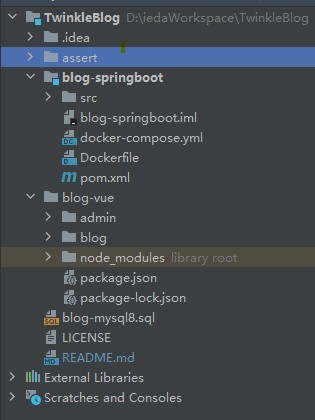
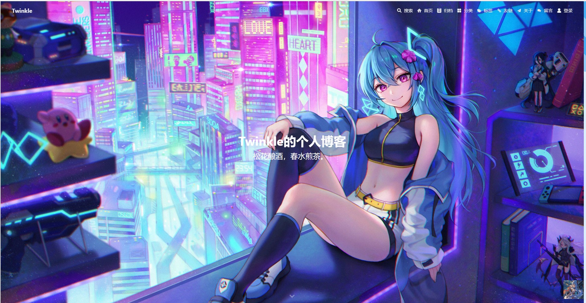
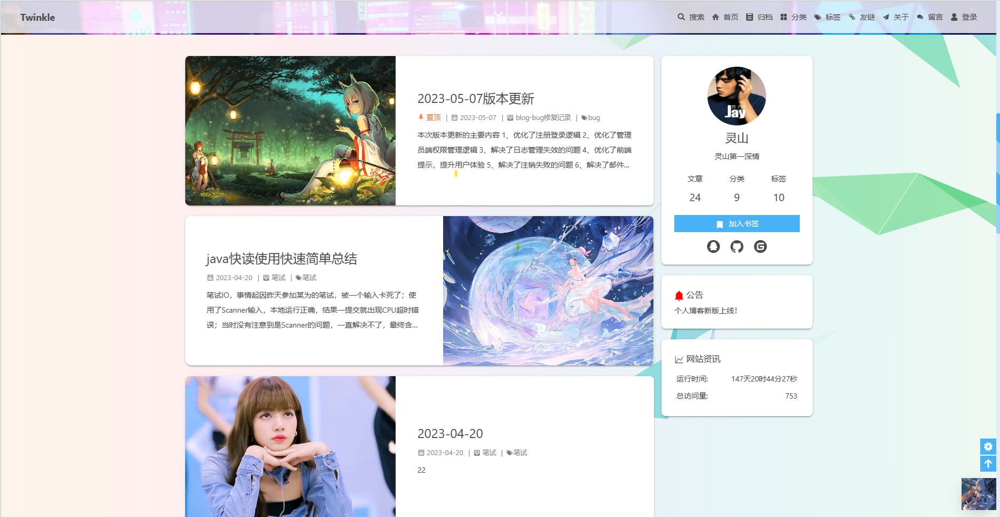
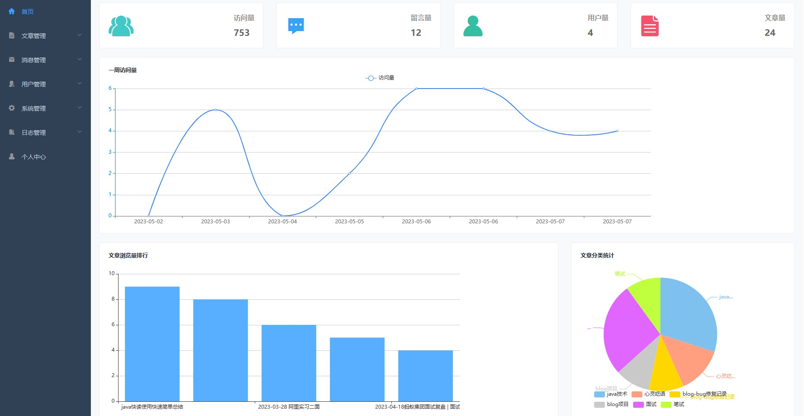

## 项目简介
- 1、这是一个个人博客项目博客项目，前后端分离开发，Docker部署，简约却不简单。
- 2、主要技术：SpringBoot + Vue + MySQL + Redis + MQ + OSS 

## 项目结构
如图所示：

- 前端项目位于blog-vue下，blog为前台，admin为后台。

- 后端项目位于blog-springboot下。

- SQL文件位于根目录下。

## 启动配置
- 1、配置Mysql、Redis、Kafka地址
- 2、配置邮箱Key、OSS服务Key

## 前端启动效果
#### 1、用户端启动效果

#### 2、管理员端启动效果

